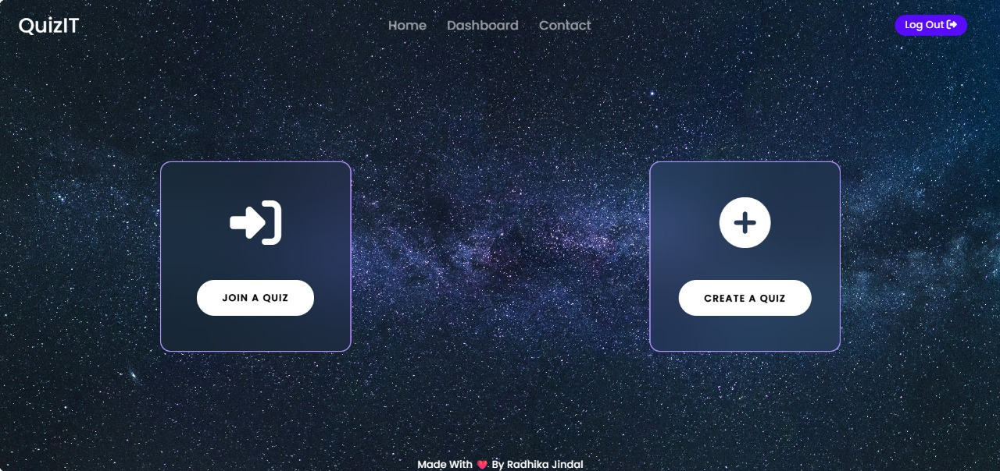
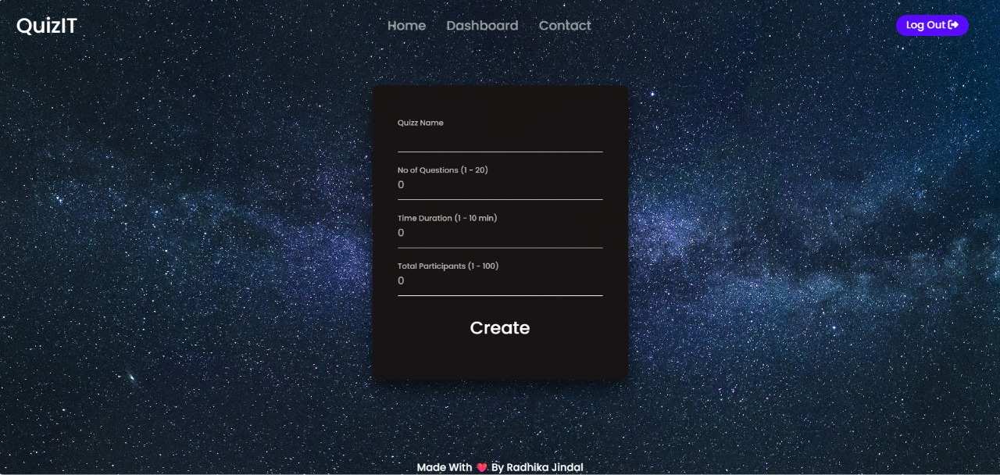
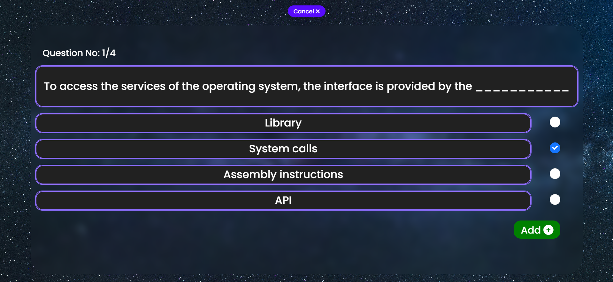
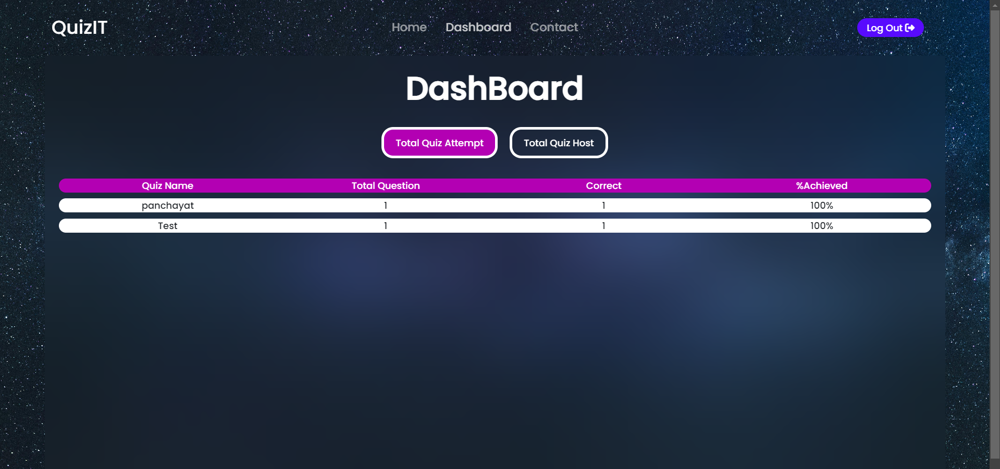
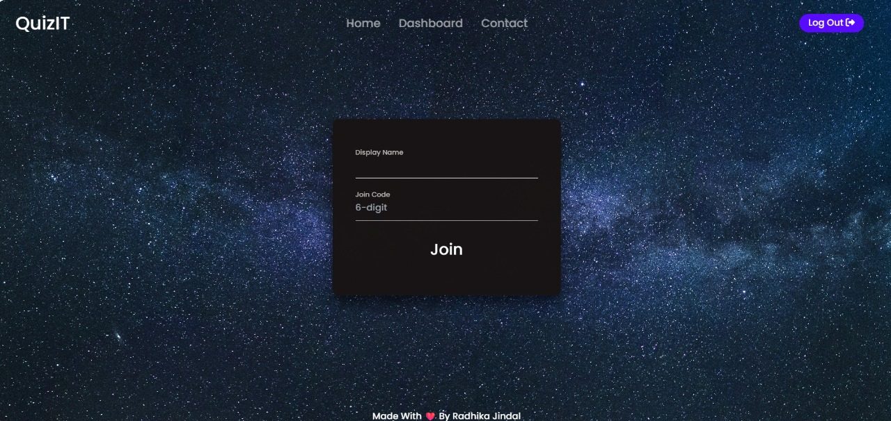
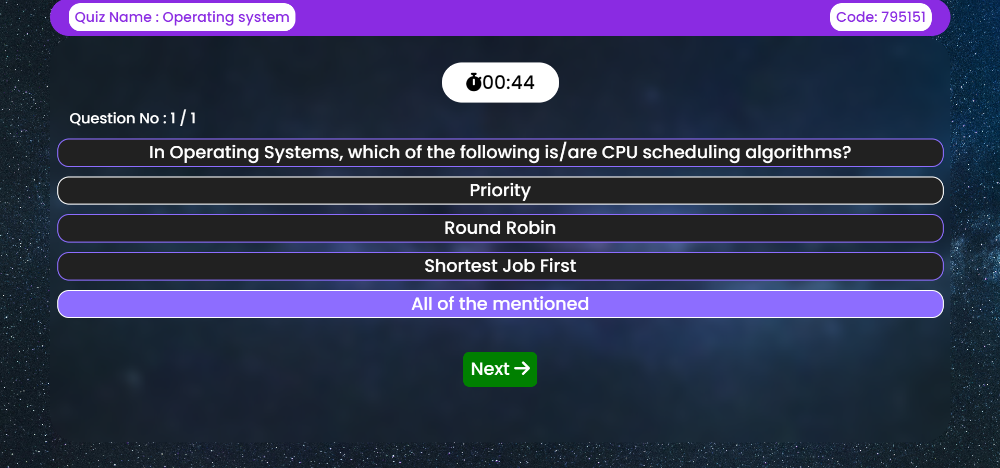
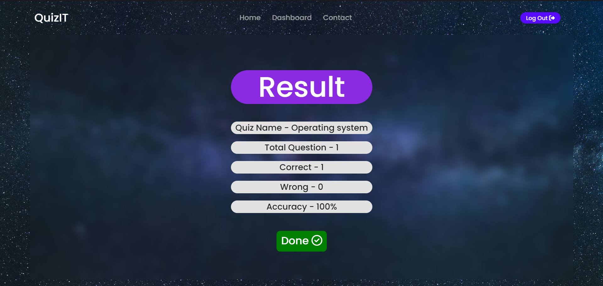
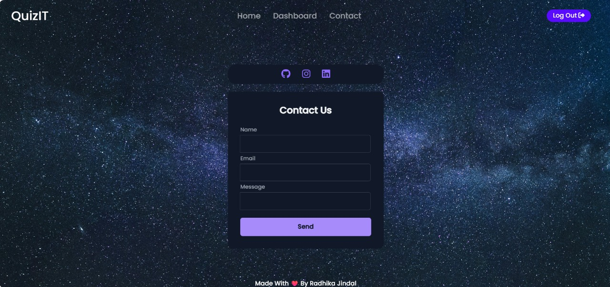

# QuizIT - A Minimalistic Quiz App

**QuizIT** is a lightweight and easy-to-use quiz application built using the MERN stack (MongoDB, Express.js, React, Node.js). The app features two primary roles: **Teacher** and **Student**. Teachers can create and manage quizzes, while students can participate in them using a unique code. This app is ideal for classrooms, training sessions, or any environment where quick quizzes are needed.

## Key Features

### Teacher Role:
- **Create Quiz**: Teachers can create quizzes by specifying a set of questions and answers.
- **Share Quiz Code**: After creating a quiz, the teacher shares a 6-digit code with students.
- **Monitor Quiz Results**: Teachers can access a dashboard to view students' performance and quiz results in real-time.

### Student Role:
- **Join Quiz**: Students can join a quiz by entering their name and the provided 6-digit code.
- **Answer Questions**: Students can take the quiz and answer the questions as they appear.
- **View Results**: After completing the quiz, students immediately see their results.

## 🚀 Live Demo

- 🔗 Frontend: [https://quizit-six.vercel.app/](https://quizit-six.vercel.app/)
- 🔗 Backend: [https://quizit-backend-sx68.onrender.com](https://quizit-backend-sx68.onrender.com)


## 🛠️ Tech Stack

| Category   |           Technology                |
|------------|-------------------------------------|
| Frontend   | React.js, Tailwind CSS              |
| Backend    | Node.js, Express.js                 |
| Database   | MongoDB (Atlas)                     |
| Auth       | JWT (JSON Web Tokens)               |
| Hosting    | Vercel (Frontend), Render (Backend) |

## Setup Instructions

1. Clone the repository
```bash
git clone https://github.com/radhikajindal13/quizit.git
```

2. Frontend Setup
```bash
cd Frontend
npm install
```

3. Backend Setup
```bash
cd Backend
npm install
```

4. Environment Variables
Create .env file in Backend directory with:
```
PORT=5000
MONGO_DB_URL=your_mongodb_uri
ACCESS_TOKEN_SECRET=your_jwt_secret

```

5. Start Backend Server
```bash
npm start
```

5. Start Frontend
```bash
npm start
```


## 👩‍💻 Author

**Radhika Jindal**  
🔗 [GitHub](https://github.com/radhikajindal13)  
🔗 [LinkedIn](https://www.linkedin.com/in/radhika-jindal-1b5a7a258/)


## Screenshots

### Sign Up


### Teacher - Create Quiz


### Teacher - Quiz Details


### Teacher - Dashboard (View Quiz Results)


### Student - Join Quiz


### Student - Answer Questions


### Student - View Results


### Contact Us

