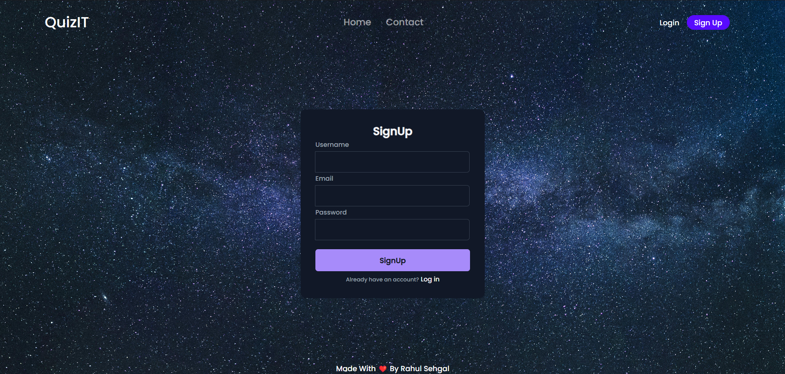
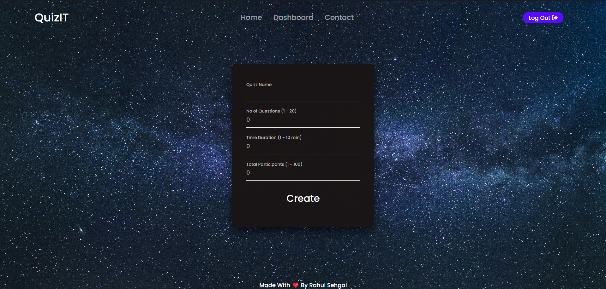
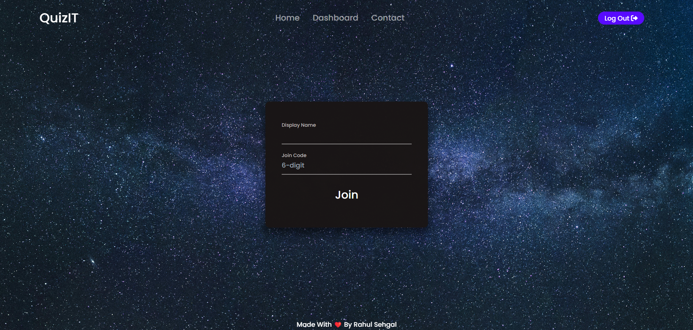
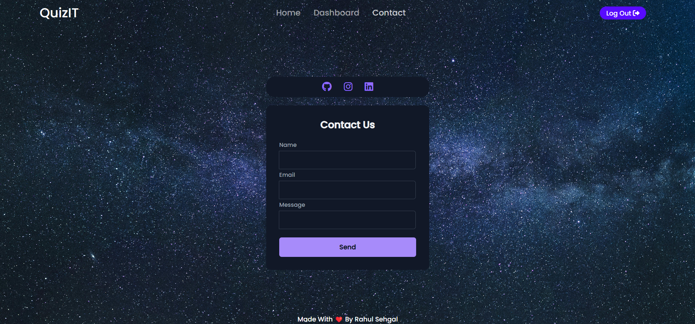

# QuizIT - A Minimalistic Quiz App

**QuizIT** is a lightweight and easy-to-use quiz application built using the MERN stack (MongoDB, Express.js, React, Node.js). The app features two primary roles: **Teacher** and **Student**. Teachers can create and manage quizzes, while students can participate in them using a unique code. This app is ideal for classrooms, training sessions, or any environment where quick quizzes are needed.

## Key Features

### Teacher Role:
- **Create Quiz**: Teachers can create quizzes by specifying a set of questions and answers.
- **Share Quiz Code**: After creating a quiz, the teacher shares a 6-digit code with students.
- **Monitor Quiz Results**: Teachers can access a dashboard to view students' performance and quiz results in real-time.

### Student Role:
- **Join Quiz**: Students can join a quiz by entering their name and the provided 6-digit code.
- **Answer Questions**: Students can take the quiz and answer the questions as they appear.
- **View Results**: After completing the quiz, students immediately see their results.

## Tech Stack
- **Frontend**: React.js, Tailwind CSS
- **Backend**: Node.js, Express.js
- **Database**: MongoDB
- **Others**: REST APIs, JWT for authentication

## Screenshots

### Sign Up

### Teacher - Create Quiz

### Teacher - Quiz Details

### Teacher - Dashboard (View Quiz Results)

### Student - Join Quiz

### Student - Answer Questions

### Student - View Results

### Contact Us

